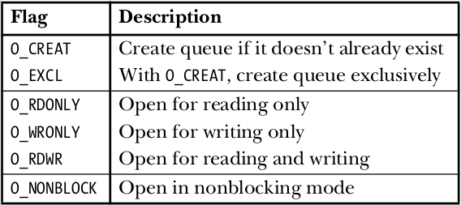
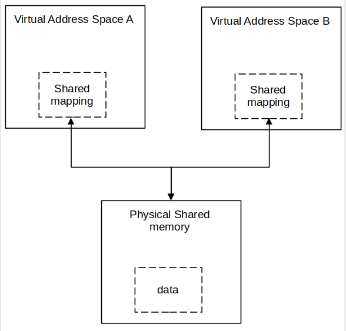
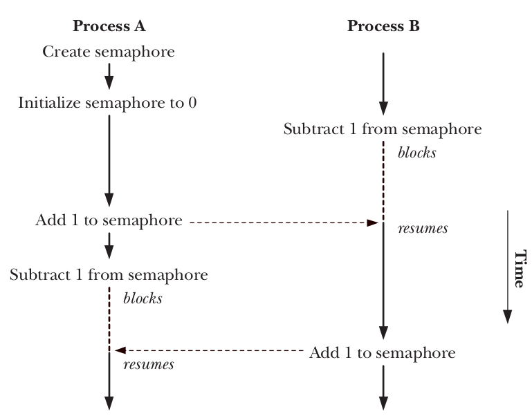
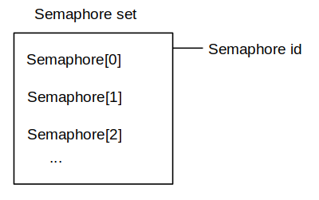

# Overview


```text
                         PROCESSES
               ┌──────────────┴──────────────┐
               │                             │
          Process A                     Process B
               │                             │
               └────────── IPC ──────────────┘
                              │
               ┌────────────┼────────────┐
               │            │            │
               Pipe       Message       Shared
                         Queue         Memory
               │            │            │
               └────────────┼────────────┘
                              │
                         Synchronization
                              │
                    ┌──────┴──────┐
                    │             │
               Semaphore       Signal
```

You can view IPC as an evolutionary process:

```text
               fork()
               │
               │ related processes
               ▼
               PIPE
               │
               │ need unrelated processes
               ▼
               FIFO
               │
               │ need structured messages
               ▼
               MESSAGE QUEUE
               │
               │ need very fast shared data
               ▼
               SHARED MEMORY
               │
               │ but now synchronization needed
               ▼
               SEMAPHORE
```

# 1. PIPE

> ***A pipe is an IPC (Inter-Process Communication) mechanism that allows one process to transmit a byte stream to another process via the kernel.***

```text
          Process A                         Process B
          │                                  │
          │ write()                          │ read()
          │                                  │
          ▼                                  ▲
          ┌──────────────────────────────────────────┐
          │                  KERNEL                  │
          │                                          │
          │             PIPE BUFFER                  │
          │                                          │
          └──────────────────────────────────────────┘
```

## 1.1 Why do PIPE exist?

Each process has its own virtual address space:

```text
Process A                  Process B

┌─────────────┐            ┌─────────────┐
│ Stack       │            │ Stack       │
│ Heap        │            │ Heap        │
│ Data        │            │ Data        │
│ Code        │            │ Code        │
└─────────────┘            └─────────────┘
```

Process A cannot simply go ahead and do:

```c
B->variable = 100;
```

because the variable resides in B's address space. It requires an intermediary mechanism. And that is **Pipe**.

**What is the pipe suitable for?**

Pipe is suited for:

- shell pipelines
- parent-child communication
- simple producer-consumer scenarios
- passing stdin/stdout
- data streaming

Not ideal if you need:

- complex message structures
- random access
- large shared datasets
- multiple clients requiring flexible communication

Pipe is primarily suitable for related processes, particularly those linked via `fork()`.

**Create pipe**

Prototype:

```c
#include <unistd.h>

int pipe(int fd[2]);
```

Return:

- 0: if successfull
- -1: if not

After Pipe success:  
Two file descriptors are stored in fd;  
bytes written on fd[1] can be read from fd[0].

```text
fd[0] = read end
fd[1] = write end
```

***The output of fd[1] is the input for fd[0].***


**pipe and fork**

Normally, we use a pipe to allow communication between two processes. To connect two processes using a pipe, we follow the `pipe()` call with a call to `fork()`. During a `fork()`, the child process inherits copies of its parent’s file descriptors, as show below:


Example Pipe and Fork:

Classic patern:

```c
int fd[2];

pipe(fd);

pid_t pid = fork();
```

```c
int main(void)
{
    int fd[2];

    if (pipe(fd) == -1)
    {
        perror("pipe");
        exit(EXIT_FAILURE);
    }

    pid_t pid = fork();

    if (pid == -1)
    {
        perror("fork");
        exit(EXIT_FAILURE);
    }

    if (pid == 0) /* child process */
    {
        /* child process close the write end
           child process simply read
        */
        close(fd[1]);
        char buffer[100];

        size_t n = read(fd[0], buffer, sizeof(buffer) - 1);

        if (n == -1)
        {
            perror("read");
            exit(EXIT_FAILURE);
        }

        buffer[n] = '\0';
        printf("%lu Child received: %s\n", n, buffer);
        close(fd[0]);
    }
    else /* parent process */
    {
        /* parent process close the read end
           parent process simply write
        */
        close(fd[0]); 
        const char *msg = "Hello from Parent";

        write(fd[1], msg, strlen(msg));
        close(fd[1]);

        wait(NULL);
    }
    return 0;
}
```

```text
17 Child received: Hello from Parent
```

We notice the appearance of the number 17; that is the return value of the `read` function, and it is the number of bytes that reader received.

Data can travel only one direction through a pipe. If we want to transfer data between parent and child process, we have to use two pipe.


## 1.2 Pipe has limited capacity

If pipe is full, `write()` can be blocked.

```c
const char *msg = "HELLO HELLO HELLO HELLO HELLO HELLO";
while (1)
{
    write(fd[1], msg, strlen(msg));
    printf("write %d time\n", n);
    n++;
}
```

```text
write 1868 time
write 1869 time
write 1870 time
write 1871 time
^C
```

I can write a `msg` string to pipe 1871 times then I can't. Because the default maximum size of pipe is 64Kb, size of `msg` is 35 byte and I write 1871 times, total of size is 65485 byte. It is 64kb.

## 1.3 Blocking

A different example about the child process does not close the write end, so, instead the parent have done writing but the child still waiting for read. It is **blocking**.

```c
int main(void)
{
    int fd1[2];

    if (pipe(fd1) == -1)
    {
        perror("pipe");
        exit(EXIT_FAILURE);
    }

    pid_t pid = fork();

    if (pid == -1)
    {
        perror("fork");
        exit(EXIT_FAILURE);
    }

    if (pid == 0) /* child process */
    {
        /* child process does not close the write end
           child process simply read and can be blocked
        */
        // close(fd1[1]);
        printf("Before read\n");
        char buffer[100];

        size_t n;

        while ((n = read(fd1[0], buffer, sizeof(buffer) - 1)) > 0)
        {
            printf("reading...\n");
        }

        printf("After read\n");

        buffer[n] = '\0';
        printf("%lu Child received: %s\n", n, buffer);

        close(fd1[0]);
    }
    else /* parent process */
    {
        /* parent process close the read end
           parent process simply write
        */
        close(fd1[0]);
        sleep(5);
        const char *msg = "Hello from Parent";
        write(fd1[1], msg, strlen(msg));
        close(fd1[1]);
        wait(NULL);
    }
    return 0;
}
```

```text
Before read
reading...
^C
```

Why? Because the parent process has already closed both the write and read ends of the pipe, but the child process retains the write end, the kernel perceives that a writer still exists. If the child process attempts to read from the empty pipe, the `read()` function blocks the process, waiting for the writer to provide data; however, the write end is held by the child process itself. This results in the child process hanging indefinitely.

>As we know, *pipe* has a limited capacity, when we write up to limit of pipe, `write()` will block until data has been removed from the pipe by some reading process.

## 1.4 SIGPIPE

*SIGPIPE* is a signal sent when we writing data to a pipe that has no read end.

Normally, If the process does not handle this signal, the default behavior for `SIGPIPE` is to terminate the process.

If we ignor or create function to handle it. we can see the return value:

Example:

```c
void signal_handler(int sig)
{
    if (sig == SIGPIPE)
    {
        printf("write fail with exit signal: SIGPIPE\n");
    }
    return;
}

int main(int argc, char *argv[])
{
    signal(SIGPIPE, signal_handler);
    int fd[2];

    if (pipe(fd) == -1)
    {
        perror("pipe");
        exit(EXIT_FAILURE);
    }

    close(fd[0]);

    const char *msg = "HELLOOOOO";
    /*
    write return the number of byte written
    return -1 if error
    */
    int ret = write(fd[1], msg, strlen(msg));
    printf("write done with return: %d\n", ret);
    
    return 0;
}
```

```text
write fail with exit signal: SIGPIPE
write done with return: -1
```

## 1.5 Deadlock

If we want to establish two-way communication, we must use two pipes.
But it can lead to deadlock.

Example:

```c
/* parent write big data and read from child */
write(fd1[1], big_data, ...);
read(fd2[0], ...);

/* child write big data and read from parent */
write(fd2[1], big_data, ...);
read(fd1[0], ...);
```

Both parent and child write big data to pipe before read, if it lead to full pipe, both are waiting for the other to read it. This is ***Deadlock in IPC.***

## 1.6 Using `pipe` for Synchronization

We can use `pipe` as a signal to synchronization process. Parent process will close the write end and `read()` to wait from pipe. Child process will close the read end, then do something (*do not write anything to pipe*). After done, the child process will close its write end. At this time, parent process can run because there are no write end and `read()` function return 0 (no write end).

Example:

```c
int main(int argc, char *argv[])
{
    int p_fd[2];

    printf("parent start\n");

    /* create pipe */
    if(pipe(p_fd) != 0)
    {
        perror("pipe");
        return -1;
    }

    switch (fork())
    {
    case -1:
        /* error */
        perror("fork");
        return -2;
        break;

    case 0:
        /* child close the read end */
        if(close(p_fd[0]) == -1)
        {
            perror("child close");
            exit(-3);
        }
        /* do something */
        sleep(5);

        printf("child closed the pipe\n");

        /* close the write end */
        if(close(p_fd[1]) == -1)
        {
            perror("child close");
            exit(-3);
        }

        exit(12);
        break;
    
    default:
        break;
    }

    /* parent close the write end */
    if(close(p_fd[1]) == -1)
    {
        perror("parent close");
        return -4;
    }

    char dummy[100];

    /* parent use read to wait for the child */
    read(p_fd[0], &dummy, 100);

    printf("parent ready to run\n");

    return 0;
}
```

```text
parent start
child closed the pipe
parent ready to run
```

# 2. popen and pclose

If we want to run a command and communicate with it via pipe.

`popen() = process + pipe + open`

`popen` create a pipe, and then fork a child process that exec a shell which turn create a child process to execute command. The mode argument detemine whether the calling process will read from pipe or write to it.

Prototype:

```c
FILE *popen (const char *command, const char *type)
/* return:
file pointer if OK
NULL if error
*/

/* type:
r: the file pointer is connected to the standard output of command
w: the file pointer is connected to the standard input of command
*/

int pclose (FILE *stream)
/* Returns:
termination status of command
or −1 on error
*/
```

  
Result of `fp = popen(command, "r")`

  
Result of `fp = popen(command, "w")`

Example read from command:

```c
/* using popen to run command passed via argument *argv[] */
int main(int argc, char *argv[])
{
    FILE *file;
    /* run command */
    file = popen("ls -l", "r");

    if(file == NULL)
    {
        perror("popen");
        return -1;
    }

    char buffer[1024];

    /* print out the result */
    while((fgets(buffer, sizeof(buffer), file)))
    {
        printf("%s", buffer);
    }

    /* close */
    pclose(file);
    return 0;
}
```

```text
document.txt
image-1.png
image-2.png
image-3.png
image-4.png
image-5.png
image.png
reader
README.md
Screenshot from 2026-09-11 15-27-51.png
test
test.c
writer
```

Example write to command:

```c
/* using popen to run command passed via argument *argv[] */
int main(int argc, char *argv[])
{
    FILE *file;
    /* run command */
    file = popen("grep Hello", "w");

    if (file == NULL)
    {
        perror("popen");
        return -1;
    }

    fprintf(file, "Hello world!\n");
    fprintf(file, "This is Linux\n");
    fprintf(file, "Hello world again!\n");

    /* close */
    pclose(file);
    return 0;
}
```

```text
Hello world!
Hello world again!
```

# 3. FIFOs

In Linux, FIFO is a IPC called **Named Pipe**

Unlike the normal pipe, FIFO has a name in filesystem.  
`/tmp/myfifo`  
and two processes can communicate without having the parent-child relationship.

## 3.1 Create FIFO

``` bash
mkfifo /tmp/myfifo
```

check:

```bash
ls -l /tmp/myfifo
```

or use C code:

```c
#include <sys/stat.h>

int mkfifo (const char *path, __mode_t mode)
```

The *path* is the name of the FIFO to be create, and the *mode* option is used to specify a permission *mode* in the same way as for the *chmod* command.

Conceptually:

```text
Filesystem
    │
    └── /tmp/myfifo
             │
             ▼
       Kernel FIFO object
             │
        ┌────┴────┐
        ▼         ▼
      writer     reader
```

Open FIFO:

```c
int fd = open("/tmp/myfifo", O_WRONLY); /* writer */

int fd = open("/tmp/myfifo", O_RDONLY); /* reader */
```

***Writer, openning the FIFO, will typically block until the reader open the FIFO.***

```text
Writer
  │
  │ open(O_WRONLY)
  ▼
BLOCK
  │
  │ wait reader
  │
  ▼
Reader appear
  │
  ▼
open() complete
```

What really happened?

Writer runs to `open` command and wait there because `open` command has not yet returned the result. Then reader call `open`, at this time, there are enough writer and reader so both can continute.

If we don't want to block when using `open`, we can use:

```c
open("/tmp/myfifo", O_WRONLY | O_NONBLOCK);
```

## 3.2 Example

This example will reproduce communication between 2 processes:  
The writer:

- write data to fifo named fifo_A_to_B
- read data from fifo named fifo_B_to_A

The reader:

- read data from fifo named fifo_A_to_B
- write data to fifo named fifo_B_to_A

Process A is the writer:

```c
int main(int argc, char *argv[])
{
    /* create fifo if it does not exist */
    mkfifo("/tmp/fifo_A_to_B", 0666);

    char buffer[512];                      /* buffer save data received */
    const char *msg = "Hello from writer"; /* data to send */

    /* open fifo */
    int fd = open("/tmp/fifo_A_to_B", O_WRONLY);
    int fd1 = open("/tmp/fifo_B_to_A", O_RDONLY);

    /* the loop comunication */
    while (1)
    {
        write(fd, msg, strlen(msg));

        int n = read(fd1, buffer, sizeof(buffer) - 1);

        buffer[n] = '\0';

        printf("%s\n", buffer);
        sleep(1); /* slow */
    }

    close(fd);
    close(fd1);
    return 0;
}
```

Process B is the reader

```c
int main(int argc, char *argv[])
{
    /* create fifo if it does not exist */
    mkfifo("/tmp/fifo_B_to_A", 0666);

    char buffer[512];                      /* buffer save data received */
    const char *msg = "Hello from reader"; /* data to send */

    /* open fifo */
    int fd = open("/tmp/fifo_A_to_B", O_RDONLY);
    int fd1 = open("/tmp/fifo_B_to_A", O_WRONLY);

    /* the loop comunication */
    while (1)
    {
        int n = read(fd, buffer, sizeof(buffer) - 1);

        buffer[n] = '\0';

        printf("%s\n", buffer);

        write(fd1, msg, strlen(msg));
        sleep(1); /* slow */
    }

    close(fd);
    close(fd1);
    return 0;
}
```

|Process A|Process B|
|:---|:---|
|Hello from reader|Hello from writer|
|Hello from reader|Hello from writer|
|Hello from reader|Hello from writer|
|Hello from reader|Hello from writer|

# 4. INTRODUCTION TO SYSTEM V IPC

```text
                 System V
                     │
                     ▼
                 key_t key
                     │
           ┌─────────┼─────────┐
           ▼         ▼         ▼
        msgget()  semget()  shmget()
           │         │         │
           ▼         ▼         ▼
         msgid     semid     shmid
```


## 4.1 Keys and IPC Identifiers

***Key*** is a value used to identify Tthe IPC object that the process wants to create or access.

***IPC ID*** is used to perform after the object is found.

**command to check Message Queue**

```bash
ipcs -q
```

IPC keys is an interger number used to determine the object which process wants to access.

Example: `key_t key = 1234;`

**How do we provide a unique key, there are three possibilities:**

- Randomly choose some interger key values, which is typically placed in header file included by all programs using the IPC object. we may accidentally choose a value used by another application.
- Specify the *IPC_PRIVATE* constant as the key value to the get call when creating the IPC object, which always results in the creation of a new IPC object that is guaranteed to have a unique key.
- Employ the `ftok()` function to generate a (likely unique) key.

Using either *IPC_PRIVATE* or `ftok()` is the usual technique.

**Create unique key with *IPC_PRIVATE***

```c
int msgid = msgget(IPC_PRIVATE, 0666);
```

This technique is especially useful in multiprocess applications where the parent process creates the IPC object prior to performing a fork(), with the result that the child inherits the identifier of the IPC object.

**Create using `ftok()`**

```c
key_t ftok(const char *pathname, int proj_id);
```

Return:

- On success, the generated key_t value is returned.
- On failure -1 is returned.

After we have the key, we can use `msgget(), semget(), shmget()` to gain the IPC ID and use it to access to the object.

## 4.2 Permission Structure

```c
/* Data structure used to pass permission information to IPC operations.
   It follows the kernel ipc64_perm size so the syscall can be made directly
   without temporary buffer copy.  However, since glibc defines the MODE
   field as mode_t per POSIX definition (BZ#18231), it omits the __PAD1 field
   (since glibc does not export mode_t as 16-bit for any architecture).  */
struct ipc_perm
{
   __key_t __key;            /* Key.  */
   __uid_t uid;              /* Owner's user ID.  */
   __gid_t gid;              /* Owner's group ID.  */
   __uid_t cuid;             /* Creator's user ID.  */
   __gid_t cgid;             /* Creator's group ID.  */
   __mode_t mode;            /* Read/write permission.  */
   unsigned short int __seq; /* Sequence number.  */
   unsigned short int __pad2;
   __syscall_ulong_t __glibc_reserved1;
   __syscall_ulong_t __glibc_reserved2;
};
```

```text
Message Queue
┌──────────────────────────┐
│ owner UID                │
│ group GID                │
│ permission mode          │
│ creator UID              │
│ creator GID              │
│ queue size               │
│ number of messages       │
│ timestamps               │
│ ...                      │
└──────────────────────────┘
```

`ipc_perm` is a structure containing information that the kernel uses to manage the ownership and access control of an IPC object.

Example we have:

|Message Queue|
|:---|
|UID|
|GID|
|mode = 0666|

**What does `0666` actually mean?**

Each number is ​​represent for an object's permission when access to a message queue.

|0|6|6|6|
|:---|:---|:---|:---|
|other mode|user|group|others|

```text
rwx rwx rwx = 111 111 111
rw- rw- rw- = 110 110 110
rwx --- --- = 111 000 000

and so on...

rwx = 111 in binary = 7
rw- = 110 in binary = 6
r-x = 101 in binary = 5
r-- = 100 in binary = 4
```

Where of course, r stands for read and w for write then x means execute.  
So `6` is read and write.

## 4.3 Configuration Limits

Since System V IPC objects consume system resources, the kernel places various limits on each class of IPC object in order to prevent resources from being exhausted.

**Some important limitations**

```c
MSGMAX      /* the maximum size of a message */
MSGMNB      /* the maximum size of a message queue */
MSGMNI      /* limits the number message queues
               that a system/IPC namespace can have */
```

Similarly, Semaphore and Shared Memory also have limits.

```c
/* Semaphore */ 
SEMMSL
SEMMNS
SEMOPM
SEMMNI

/* Shared Memory */
SHMMAX
SHMMIN
SHMALL
SHMMNI
```

## 4.4 Command with IPC

### see all IPC

```bash
ipcs
```

```text
------ Message Queues --------
key        msqid      owner      perms      used-bytes   messages    

------ Shared Memory Segments --------
key        shmid      owner      perms      bytes      nattch     status      

------ Semaphore Arrays --------
key        semid      owner      perms      nsems  
```

### see limit

```bash
ipcs -l
```

```text
------ Messages Limits --------
max queues system wide = 32000
max size of message (bytes) = 8192
default max size of queue (bytes) = 16384

------ Shared Memory Limits --------
max number of segments = 4096
max seg size (kbytes) = 18014398509465599
max total shared memory (kbytes) = 18446744073709551612
min seg size (bytes) = 1

------ Semaphore Limits --------
max number of arrays = 32000
max semaphores per array = 32000
max semaphores system wide = 1024000000
max ops per semop call = 500
semaphore max value = 32767
```

### delete Message Queue

```bash
ipcrm -q <msg_id>
```

# 5. Message: System V Message Queue, POSIX Message Queue

**Compare Message Queue between System V and Posix**

|                    | System V MQ             | POSIX MQ         |
| :----------------- | :---------------------- | :--------------- |
| Header             | `<sys/msg.h>`           | `<mqueue.h>`     |
| create/open        | `msgget()`              | `mq_open()`      |
| send               | `msgsnd()`              | `mq_send()`      |
| receive            | `msgrcv()`              | `mq_receive()`   |
| delete             | `msgctl(..., IPC_RMID)` | `mq_unlink()`    |
| ID                 | `int`                   | `mqd_t`          |
| Message type       | yes                     | not like SysV    |
| Priority           | no                      | yes              |
| Kernel object      | SysV IPC object         | POSIX MQ         |
| blocking           | yes                     | yes              |
| nonblocking        | yes                     | yes              |

## What is **message**?

First, byte stream is a sequence of individual data bytes transmitted continuously over time; it does not distinguish between message 1 and message 2.

Message Queue solve this problem.

A Message Queue is an IPC mechanism that allows processes to exchange data in the form of independent messages.

## Why we need Message Queue?

If we have many command such as:

```text
START
STOP
MOVE 100 100
GET STATUS
```

We have create a protocol to know what message is. Example:

```text
START\n
STOP\n
MOVE 100 100\n
GET STATUS\n
```

In message queues, the kernel provides an abstraction:


This is the reason **message queue** suitable for application that have many command, message.

## 5.1 System V Message Queue

### a. Create Message Queue

```c
#include <sys/types.h>
#include <sys/msg.h>
/* For portability */
int msgget(key_t key, int msgflg);
/* Returns message queue identifier on success,
   or –1 on error */
```

Example:

```c
    key_t key = 1234;

    int msg_id = msgget(key, IPC_CREAT | 0660);
```

### b. Send message to Message Queue

Prototype:

```c
#include <sys/msg.h>
/* For portability */
int msgsnd(int msqid, const void *msgp, size_t msgsz, int msgflg);
                            /* Returns 0 on success, or –1 on error */
```

Example:

```c
int main(int argc, char *argv[])
{
    key_t key = 1234;

    int msg_id = msgget(key, IPC_CREAT | 0660);

    if (msg_id == -1)
    {
        perror("mssget");
        return -1;
    }

    /* create message to send */
    struct message msg1;
    msg1.msg_type = 1;
    strcpy(msg1.msg_text, "HiHiHi HeHeHe");

    /* send message */
    if (msgsnd(msg_id, &msg1, strlen(msg1.msg_text) + 1, 0) == -1)
    {
        perror("msgsnd");
        return -3;
    }

    return 0;
}
```

### c. Receive message

Prototype:

```c
#include <sys/msg.h>
/* For portability */
ssize_t msgrcv(int msqid, void *msgp, size_t maxmsgsz, long msgtyp, int msgflg);
                            /* Returns number of bytes copied into mtext field,
                            or –1 on error */
```

`msgtyp` is the type field of message that receiver want to claim.

`msgflg`  specifies the action to be taken if a message of the desired type is not on the queue. These are as follows:

- If (msgflg & IPC_NOWAIT) is non-zero, the calling thread shall return immediately with a return value of -1 and errno set to
           [ENOMSG].

- If (msgflg & IPC_NOWAIT) is 0, the calling thread shall suspend execution until one of the following occurs:

- A message of the desired type is placed on the queue.
- The message queue identifier *msqid* is removed from the system; when this occurs, errno shall be set to [EIDRM] and -1 shall be returned.

- The calling thread receives a signal that is to be caught; in this case a message is not received and the calling thread resumes execution in the manner prescribed in sigaction(3p).

If I don't want to wait, I can use `IPC_NOWAIT` to pass to `msgflg` argument.

Example:

```c
int main(int argc, char *argv[])
{
    key_t key = 1234;

    int msg_id = msgget(key, IPC_CREAT | 0660);

    if (msg_id == -1)
    {
        perror("mssget");
        return -1;
    }

    /* receive message */
    struct message receive;
    if (msgrcv(msg_id, &receive, sizeof(receive.msg_text), 0, 0) == -1)
    {
        perror("msgrcv");
        return -2;
    }

    return 0;
}
```

### d. Block

>**`msgsnd` is able to block**

We have the limit of each message is 8192 bytes (by using `ipcs -l`).

If queue currently has 8000 bytes. Then I send another 500 bytes, it lead to block.

Because queue is full and `msgsnd` will block until receiver takes data out.

```text
msgsnd()                                            msgrcv()
   |                                                    |
   v                                                    v
Queue full / insufficient space                 space available
   |                                                    |
   v                                                    v
SLEEP                                               wake sender
```

### e. Delete queue

Prototype:

```c
int msgctl(int msqid, int cmd, struct msqid_ds *buf);
```

Example: `msgctl(msqid, IPC_RMID, NULL);`

>**Some processes blocked on the queue may also be awakened and receive an error, depending on the specific system call or state.**

## 5.2 POSIX Message Queue

Header:

```c
#include <mqueue.h>
```

API:

```c
mq_open()
mq_send()
mq_receive()
mq_close()
mq_unlink()
mq_getattr()
mq_setattr()
```

Queue has the name. Example: `mqd_t mq = mq_open("/my_queue", ...)`.  
The first character of name must be *'/'*:

```text
/my_queue
/chat
/robot_command
/sensor_data
```

### a. Openning/Creating a message Queue

Prototype:

```c
mqd_t mq_open(const char *__name, int __oflag, ...
                /* mode_t mode, struct mq_attr *attr */)

                /* Returns a message queue descriptor on success,
                or (mqd_t) –1 on error */
```

- The `__name` argument identifies the message queue.
- The `__oflag` argument is a bit mask that controls various aspects of the operation of
`mq_open()`. The values that can be included in this mask are summarized in Table below:



- If `__oflag` includes O_CREAT, a new, empty queue is created if one with the given name doesn’t already exist.
- If `__oflag` specifies both O_CREAT and O_EXCL, and a queue with the given name already exists, then
mq_open() fails.

### b. Message Attributes

The `mq_open()`, `mq_getattr()`, and `mq_setattr()` functions all permit an argument that
is a pointer to an mq_attr structure. This structure is defined in <bits/mqueue.h> as follows:

```c
struct mq_attr
{
  __syscall_slong_t mq_flags;     /* Message queue flags
                                        [mq_getattr(), mq_setattr()] */
  __syscall_slong_t mq_maxmsg;     /* Maximum number of messages
                                        [mq_open(), mq_getattr()] */
  __syscall_slong_t mq_msgsize;     /* Maximum message size
                                        [mq_open(), mq_getattr()] */
  __syscall_slong_t mq_curmsgs;     /* Number of messages currently queued
                                        [mq_getattr()] */
};
```

- Only some of the fields are used by each of the three functions. The fields used
by each function are indicated in the comments accompanying the structure
definition above.

**Setting message queue attributes during queue creation**

When we create a message queue with `mq_open()`, the following `mq_attr` fields determine the attributes of the queue:

- The `mq_maxmsg` field defines the limit on the number of messages that can be placed on the queue `using mq_send()`. This value must be greater than 0.
- The `mq_msgsize` field defines the upper limit on the size of each message that may be placed on the queue. This value must be greater than 0.

Example:

```c
    struct mq_attr attr;

    attr.mq_flags = O_CREAT;
    attr.mq_maxmsg = 10;    /* maximum number of message */
    attr.mq_msgsize = 50;   /* maximum message size */
```

**Retrieving message queue attributes**

The `mq_getattr()` function returns an `mq_attr` structure containing information about the message queue description and the message queue associated with the descriptor `mqdes`.

Prototype:

```c
#include <mqueue.h>

int mq_getattr(mqd_t mqdes, struct mq_attr *attr);
            /* Returns 0 on success, or –1 on error */
```

Example:

```c
mqd_t mq = mq_open("/hihi", O_CREAT);

struct mq_attr attr;

mq_getattr(mq, &attr);

printf("flags   = %ld\n", attr.mq_flags);
printf("maxmsg  = %ld\n", attr.mq_maxmsg);
printf("msgsize = %ld\n", attr.mq_msgsize);
printf("curmsgs = %ld\n", attr.mq_curmsgs);
```

We can receive the attributes of message queue `mq` stored in the memory region pointed by `attr`.

**Modifying message queue attributes**

The `mq_setattr()` function sets attributes of the message queue description associated with the message queue descriptor `mqdes`, and optionally returns information about the message queue.

```c
#include <mqueue.h>

int mq_setattr(mqd_t mqdes, const struct mq_attr *newattr,
                struct mq_attr *oldattr);
                    /* Returns 0 on success, or –1 on error */
```

### c. Sending Message

Prototype:

```c
int mq_send(mqd_t mqdes, const char *msg_ptr, size_t msg_len,
            unsigned int msg_prio);
                        /* Returns 0 on success, or –1 on error */
```

Similar to System V, send message using Posix also has name `mqdes`, a pointer `msg_ptr` points to the memory region that stores the data wnat to send, length of message `msg_len`, and unlike the System V, each message has a nonnegative integer priority, specified by the `msg_prio` argument.

**Priority of message**  
Messages are ordered within the queue in descending order of priority.

```text
Message scd             P = 10
Message cdsvf           P = 5
Message avsdc           P = 2
Message htrr            P = 1
```

- If an application doesn’t need to use message priorities, it is sufficient to always specify `msg_prio` as 0.

### d. Receiving Message

Prtotype:

```c
ssize_t mq_receive(mqd_t mqdes, char *msg_ptr, size_t msg_len,
                    unsigned int *msg_prio);
            /* Returns number of bytes in received message on success,
                   or –1 on error */
```

- Regardless of the actual size of the message, `msg_len` must be greater than or equal to the `mq_msgsize` attribute of the queue; otherwise, `mq_receive()` fails with the error EMSGSIZE.
- If we don’t know the value of the `mq_msgsize` attribute of a queue, we can obtain it using `mq_getattr()`.
- If `msg_prio` is not NULL, then the priority of the received message is copied into the location pointed to by `msg_prio`.

### e. Closing, and Unlinking a Message Queue

**Closing a message queue**

The `mq_close()` function closes the message queue descriptor mqdes.

```c
#include <mqueue.h>

int mq_close(mqd_t mqdes);
        /* Returns 0 on success, or –1 on error */
```

- If the calling process has registered via `mqd_t mqdes` for message notification from the queue, then the notification registration is automatically removed, and another process can subsequently register for message notification from the queue.
- A message queue descriptor is automatically closed when a process terminates or calls exec(). As with file descriptors, we should explicitly close message queue descriptors that are no longer required, in order to prevent the process from running out of message queue descriptors.
- As `close()` for files, closing a message queue doesn’t delete it. For that purpose, we need `mq_unlink()`, which is the message queue analog of `unlink()`.

**Removing a message queue**

The `mq_unlink()` function removes the message queue identified by name, and marks the queue to be destroyed once all processes cease using it (this may mean immediately, if all processes that had the queue open have already closed it).

```c
#include <mqueue.h>

int mq_unlink(const char *name);
        /* Returns 0 on success, or –1 on error */
```

### f. Blocking

**Blocking with `mq_send()`**
If the message queue is already full, then a further `mq_send()` either blocks until space becomes available
in the queue, or, if the O_NONBLOCK flag is in effect, fails immediately with the error
EAGAIN.

**Blocking with `mq_receive()`**
If the message queue is currently empty, then `mq_receive()` either blocks until a
message becomes available, or, if the O_NONBLOCK flag is in effect, fails immediately
with the error EAGAIN.

### g. Command with Posix Message Queue

**See the location of message**

```bash
mount | grep mqueue
```

**See list of message**

```bash
ls -l /dev/mqueue/
```

**See the information inside the message**

```bash
cat /dev/mqueue/name_msq
```

**delete queue**

```bash
rm /dev/mqueue/my_queue
```

# 6. Shared Memory (System V) and Client/Server Properties

**What is Shared Memory?**

Shared Memory is a memory region managed by kernel, it allows multiple processes to access to a common data.

Shared memory does not mean two processes using the same memory region in RAM.

Each process still has its Virtual Address Space.What is shared are the physical memory pages mapped into the virtual address space of each process.



**Why we need Shared Memory?**

We have just explored message queues; when a sender wants to send data to a reader, it must go through the kernel. However, with shared memory, this is not necessary, as data is shared directly via a common memory area.

## 6.1 Shared Memory (System V)

In order to use a shared memory segment, we typically perform the following steps:

- Call `shmget()` to create a new shared memory segment or obtain the identifier of an existing segment. This call returns a shared memory identifier for use in later calls.

- Use `shmat()` to attach the shared memory segment; that is, make the segment part of the virtual memory of the calling process.

At this point, the shared memory segment can be treated just like any other memory available to the program. In order to refer to the shared memory, the program uses the `addr` value returned by the `shmat()` call, which is a pointer to the start of the shared memory segment in the process’s virtual address space.

```text
                                     Kernel
                                       │
                               ┌───────▼────────┐
                               │ Shared Memory  │
                               │    Segment     │
                               └───────┬────────┘
                                       │
                                ┌──────┴──────┐
                                │             │
                                ▼             ▼
                            Process A      Process B
                            shmat()        shmat()
                                │             │
                                ▼             ▼
                            pointer A      pointer B
```

- Call `shmdt()` to detach the shared memory segment. After this call, the process can no longer refer to the shared memory. This step is optional, and happens automatically on process termination.

- Call `shmctl()` to delete the shared memory segment. The segment will be destroyed only after all currently attached processes have detached it. Only one process needs to perform this step.

### a. Create or Open a Shared Memory Segment

Prototype:

```c
#include <sys/ipc.h>
#include <sys/shm.h>

int shmget(key_t key, size_t size, int shmflg);
    /* Returns shared memory segment identifier on success,
        or –1 on error */
```

### b. Using Shared Memory Segment

Prototype:

```c
#include <sys/shm.h>

void *shmat(int shmid, const void *shmaddr, int shmflg);
        /* Returns address at which shared memory is attached on success,
                or (void *) –1 on error */
```

- If `shmaddr` is NULL, then the segment is attached at a suitable address selected by the kernel. This is **the preferred method** of attaching a segment.
- If `shmaddr` is not NULL, and `SHM_RND` is not set, then the segment is attached at the address specified by `shmaddr`, which must be a multiple of the system page size (or the error EINVAL results).
- If `shmaddr` is not NULL, and `SHM_RND` is set, then the segment is mapped at the address provided in `shmaddr`, rounded down to the nearest multiple of the con-stant `SHMLBA` (shared memory low boundary address).

### c. Detaching a Shared Memory Segment

Prototype:

```c
#include <sys/shm.h>

int shmdt(const void *shmaddr);
        /* Returns 0 on success, or –1 on error */
```

### d. Control Shared Memory

Prototype:

```c
int shmctl(int shmid, int cmd, struct shmid_ds *buf);
        /* Returns 0 on success, or –1 on error */
```

The `cmd` argument specifies the control operation to be performed.

**Generic control operations**

*IPC_RMID*  
Mark the shared memory segment and its associated `shmid_ds` data structure for deletion. If no processes currently have the segment attached, deletion is immediate; otherwise, the segment is removed after all processes have detached from it

*IPC_STAT*  
Place a copy of the `shmid_ds` data structure associated with this shared memory segment in the buffer pointed to by `buf`.

*IPC_SET*  
Update selected fields of the `shmid_ds` data structure associated with this shared memory segment using values in the buffer pointed to by `buf`.

### e. Shared Memory Associated Data Structure

Each shared memory segment has an associated `shmid_ds` data structure of the following form:

```c
struct shmid_ds
{
    struct ipc_perm shm_perm; /* operation permission struct */
    size_t shm_segsz;         /* size of segment in bytes */
    __time_t shm_atime;       /* time of last shmat() */
    __time_t shm_dtime;       /* time of last shmdt() */
    __time_t shm_ctime;       /* time of last change by shmctl() */
    __pid_t shm_cpid;         /* pid of creator */
    __pid_t shm_lpid;         /* pid of last shmop */
    shmatt_t shm_nattch;      /* number of current attaches */
};
```

## 6.2 Shared Memory (Posix)

## 6.3 Client/Server Properties

**Why is it called Client/Server?**

Conventions:

```text
Server

- creating shared memory
- setting up data structures
- waiting for requests
- processing requests
- generating responses
- managing the IPC lifecycle

Client

- locates the shared memory created by the server
- attaches to it
- writes the request
- waits for the response
- reads the response
- detaches from it
```

**How does the server know when the client has finished writing?**

We must design the protocol ourself.

Example:

```c
struct data {
    char request[20];
    char response[20];
    bool request_ready;
    bool response_ready;
};
```

# 7. Semaphore

## 7.1 Semaphore System V

A System V semaphore is a kernel IPC object used for synchronization between:

- processes
- threads within the same process
- It is particularly common in multi-process models accessing shared memory.

>**Shared memory allows processes to share data. Semaphores ensure they access that data in the correct order.**



The general steps for using a System V semaphore are the following:

- Create or open a semaphore set using `semget()`.
- Initialize the semaphores in the set using the `semctl()` SETVAL or SETALL operation. (Only one process should do this)
- Perform operations on semaphore values using `semop()`. The processes using the semaphore typically use these operations to indicate acquisition and release of a shared resource.
- When all processes have finished using the semaphore set, remove the set using the `semctl()` IPC_RMID operation. (Only one process should do this)

**Posxi** typically operate on a semaphore object.  
**System V** typically create semaphore set, there are more semaphore inside.



### a. Create or Opening a Semaphore set

Prototype:

```c
#include <sys/types.h>
#include <sys/ipc.h>
#include <sys/sem.h>

int semget(key_t key, int nsems, int semflg);

        /* Returns semaphore set identifier on success,
            or –1 on error */
```

- `key` argument is a key generated using one of the methods: use the value IPC_PRIVATE or a key returned by `ftok()`.
- `nsems` specifies the number of semaphores in that set, and must be greater than 0.
- `semflg` argument is a bit mask specifying the permissions to be placed on a new semaphore set or checked against an existing set.

Example:

```c
    key_t key = ftok("/tmp", 'A');

    if (key == -1) {
        perror("ftok");
        exit(EXIT_FAILURE);
    }

    int semid = semget(key, 5, IPC_CREAT | 0666);

    if (semid == -1) {
        perror("semget");
        exit(EXIT_FAILURE);
    }
```

### b. Semaphore Control Operations

Prototype:

```c
#include <sys/types.h>
#include <sys/ipc.h>
#include <sys/sem.h>

int semctl(int semid, int semnum, int cmd, union semun arg);

        /* Returns nonnegative integer on success (see text);
            returns –1 on error */
```

- `semnum` argument identifies a particular semaphore within the set
- `cmd` argument specifies the operation to be performed.

**Generic control operations**

IPC_STAT : Place a copy of the `semid_ds` data structure associated with this semaphore set in the buffer pointed to by `arg.buf`.  

IPC_SET : Update selected fields of the semid_ds data structure associated with this semaphore set using values in the buffer pointed to by arg.buf.  

IPC_RMID : Immediately remove the semaphore set and its associated semid_ds data structure. Any processes blocked in `semop()` calls waiting on semaphores in this set are immediately awakened.

**Retrieving and initializing semaphore values**

SETVAL : set the value for a semaphore.  

```c
semctl(semid, 0, SETVAL, 1);
```

GETVAL : get the value of a semaphore.  

```c
int value = semctl(semid, 0, GETVAL);
```

SETALL : set all value for semaphore set.  

```c
unsigned short values[3];

values[0] = 1;
values[1] = 2;
values[2] = 3; 

semctl(semid, 0, SETALL, values);
```

GETALL : get all value of semaphore set into array.  

```c
unsigned short values[3];

semctl(semid, 0, GETALL, values);
```

**Semaphore Associated Data Structure**
Prototype:

```c
struct semid_ds
{
  struct ipc_perm sem_perm;   /* operation permission struct */
  __time_t sem_otime;  /* last semop() time */
  __syscall_ulong_t __sem_otime_high;
  __time_t sem_ctime;  /* last time changed by semctl() */
  __syscall_ulong_t __sem_ctime_high;
  __syscall_ulong_t sem_nsems;    /* number of semaphores in set */
  __syscall_ulong_t __glibc_reserved3;
  __syscall_ulong_t __glibc_reserved4;
};
```

### c. Semaphore Operations

Prototype:

```c
#include <sys/sem.h>

int semop (int semid, struct sembuf *sops, size_t nsops)

            /* Returns 0 on success, or –1 on error */
```

- `sops` argument is a pointer points to an array that contains the operations to be performed.
- `nsops` gives the size of this array (which must contain at least one element).

The elements of the `sops` array are structures of the following form:

```c
struct sembuf
{
  unsigned short int sem_num; /* semaphore number */
  short int sem_op; /* semaphore operation */
  short int sem_flg; /* operation flag */
};
```

- If `sem_op` is greater than 0, the value of `sem_op` is added to the semaphore value.
- If `sem_op` equals 0, the value of the semaphore is checked to see whether it currently equals 0. If it does, the operation completes immediately; otherwise, `semop()` blocks until the semaphore value becomes 0.
- If `sem_op` is less than 0, decrease the value of the semaphore by the amount specified in `sem_op`. If the current value of the semaphore is greater than or equal to the absolute value of `sem_op`, the operation completes immediately. Otherwise, `semop()` blocks until the semaphore value has been increased to a level that permits the operation to be performed without resulting in a negative value.

Example:

```c
    struct sembuf sembuff;
    sembuff.sem_num = 0;
    sembuff.sem_op = 0;
    sembuff.sem_flg = 0;

    semop(sem_id, &sembuff, 1);
```
