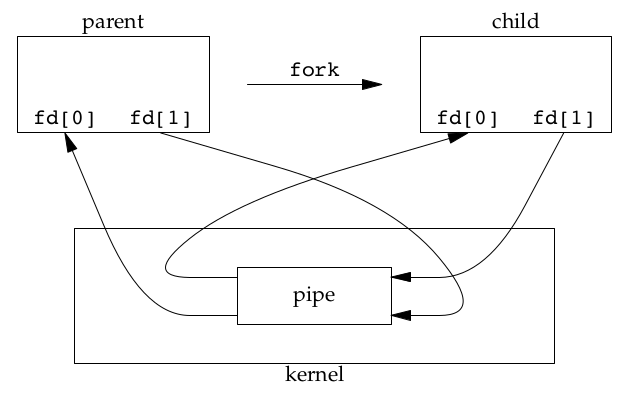
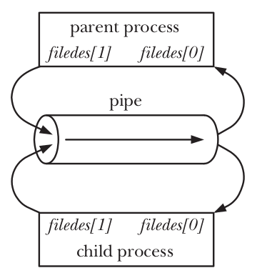
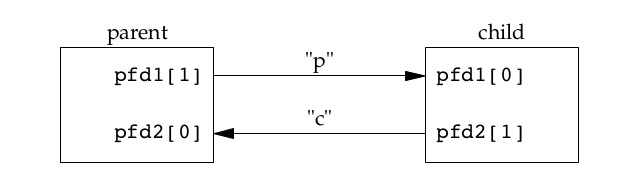
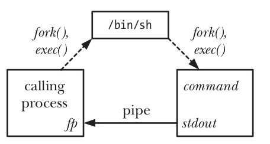
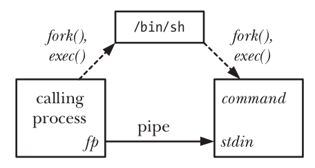
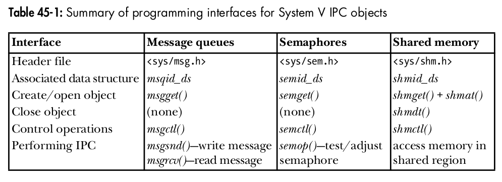
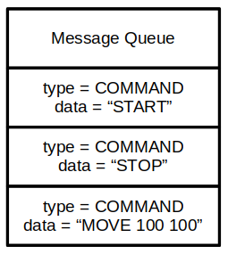

# Overview


```text
                         PROCESSES
               ┌──────────────┴──────────────┐
               │                             │
          Process A                     Process B
               │                             │
               └────────── IPC ──────────────┘
                              │
               ┌────────────┼────────────┐
               │            │            │
               Pipe       Message       Shared
                         Queue         Memory
               │            │            │
               └────────────┼────────────┘
                              │
                         Synchronization
                              │
                    ┌──────┴──────┐
                    │             │
               Semaphore       Signal
```

You can view IPC as an evolutionary process:

```text
               fork()
               │
               │ related processes
               ▼
               PIPE
               │
               │ need unrelated processes
               ▼
               FIFO
               │
               │ need structured messages
               ▼
               MESSAGE QUEUE
               │
               │ need very fast shared data
               ▼
               SHARED MEMORY
               │
               │ but now synchronization needed
               ▼
               SEMAPHORE
```

# 1. PIPE

> ***A pipe is an IPC (Inter-Process Communication) mechanism that allows one process to transmit a byte stream to another process via the kernel.***

```text
          Process A                         Process B
          │                                  │
          │ write()                          │ read()
          │                                  │
          ▼                                  ▲
          ┌──────────────────────────────────────────┐
          │                  KERNEL                  │
          │                                          │
          │             PIPE BUFFER                  │
          │                                          │
          └──────────────────────────────────────────┘
```

## 1.1 Why do PIPE exist?

Each process has its own virtual address space:

```text
Process A                  Process B

┌─────────────┐            ┌─────────────┐
│ Stack       │            │ Stack       │
│ Heap        │            │ Heap        │
│ Data        │            │ Data        │
│ Code        │            │ Code        │
└─────────────┘            └─────────────┘
```

Process A cannot simply go ahead and do:

```c
B->variable = 100;
```

because the variable resides in B's address space. It requires an intermediary mechanism. And that is **Pipe**.

**What is the pipe suitable for?**

Pipe is suited for:

- shell pipelines
- parent-child communication
- simple producer-consumer scenarios
- passing stdin/stdout
- data streaming

Not ideal if you need:

- complex message structures
- random access
- large shared datasets
- multiple clients requiring flexible communication

Pipe is primarily suitable for related processes, particularly those linked via `fork()`.

**Create pipe**

Prototype:

```c
#include <unistd.h>

int pipe(int fd[2]);
```

Return:

- 0: if successfull
- -1: if not

After Pipe success:  
Two file descriptors are stored in fd;  
bytes written on fd[1] can be read from fd[0].

```text
fd[0] = read end
fd[1] = write end
```

***The output of fd[1] is the input for fd[0].***



**pipe and fork**

Normally, we use a pipe to allow communication between two processes. To connect two processes using a pipe, we follow the `pipe()` call with a call to `fork()`. During a `fork()`, the child process inherits copies of its parent’s file descriptors, as show below:



Example Pipe and Fork:

Classic patern:

```c
int fd[2];

pipe(fd);

pid_t pid = fork();
```

```c
int main(void)
{
    int fd[2];

    if (pipe(fd) == -1)
    {
        perror("pipe");
        exit(EXIT_FAILURE);
    }

    pid_t pid = fork();

    if (pid == -1)
    {
        perror("fork");
        exit(EXIT_FAILURE);
    }

    if (pid == 0) /* child process */
    {
        /* child process close the write end
           child process simply read
        */
        close(fd[1]);
        char buffer[100];

        size_t n = read(fd[0], buffer, sizeof(buffer) - 1);

        if (n == -1)
        {
            perror("read");
            exit(EXIT_FAILURE);
        }

        buffer[n] = '\0';
        printf("%lu Child received: %s\n", n, buffer);
        close(fd[0]);
    }
    else /* parent process */
    {
        /* parent process close the read end
           parent process simply write
        */
        close(fd[0]); 
        const char *msg = "Hello from Parent";

        write(fd[1], msg, strlen(msg));
        close(fd[1]);

        wait(NULL);
    }
    return 0;
}
```

```text
17 Child received: Hello from Parent
```

We notice the appearance of the number 17; that is the return value of the `read` function, and it is the number of bytes that reader received.

Data can travel only one direction through a pipe. If we want to transfer data between parent and child process, we have to use two pipe.



## 1.2 Pipe has limited capacity

If pipe is full, `write()` can be blocked.

```c
const char *msg = "HELLO HELLO HELLO HELLO HELLO HELLO";
while (1)
{
    write(fd[1], msg, strlen(msg));
    printf("write %d time\n", n);
    n++;
}
```

```text
write 1868 time
write 1869 time
write 1870 time
write 1871 time
^C
```

I can write a `msg` string to pipe 1871 times then I can't. Because the default maximum size of pipe is 64Kb, size of `msg` is 35 byte and I write 1871 times, total of size is 65485 byte. It is 64kb.

## 1.3 Blocking

A different example about the child process does not close the write end, so, instead the parent have done writing but the child still waiting for read. It is **blocking**.

```c
int main(void)
{
    int fd1[2];

    if (pipe(fd1) == -1)
    {
        perror("pipe");
        exit(EXIT_FAILURE);
    }

    pid_t pid = fork();

    if (pid == -1)
    {
        perror("fork");
        exit(EXIT_FAILURE);
    }

    if (pid == 0) /* child process */
    {
        /* child process does not close the write end
           child process simply read and can be blocked
        */
        // close(fd1[1]);
        printf("Before read\n");
        char buffer[100];

        size_t n;

        while ((n = read(fd1[0], buffer, sizeof(buffer) - 1)) > 0)
        {
            printf("reading...\n");
        }

        printf("After read\n");

        buffer[n] = '\0';
        printf("%lu Child received: %s\n", n, buffer);

        close(fd1[0]);
    }
    else /* parent process */
    {
        /* parent process close the read end
           parent process simply write
        */
        close(fd1[0]);
        sleep(5);
        const char *msg = "Hello from Parent";
        write(fd1[1], msg, strlen(msg));
        close(fd1[1]);
        wait(NULL);
    }
    return 0;
}
```

```text
Before read
reading...
^C
```

Why? Because the parent process has already closed both the write and read ends of the pipe, but the child process retains the write end, the kernel perceives that a writer still exists. If the child process attempts to read from the empty pipe, the `read()` function blocks the process, waiting for the writer to provide data; however, the write end is held by the child process itself. This results in the child process hanging indefinitely.

>As we know, *pipe* has a limited capacity, when we write up to limit of pipe, `write()` will block until data has been removed from the pipe by some reading process.

## 1.4 SIGPIPE

*SIGPIPE* is a signal sent when we writing data to a pipe that has no read end.

Normally, If the process does not handle this signal, the default behavior for `SIGPIPE` is to terminate the process.

If we ignor or create function to handle it. we can see the return value:

Example:

```c
void signal_handler(int sig)
{
    if (sig == SIGPIPE)
    {
        printf("write fail with exit signal: SIGPIPE\n");
    }
    return;
}

int main(int argc, char *argv[])
{
    signal(SIGPIPE, signal_handler);
    int fd[2];

    if (pipe(fd) == -1)
    {
        perror("pipe");
        exit(EXIT_FAILURE);
    }

    close(fd[0]);

    const char *msg = "HELLOOOOO";
    /*
    write return the number of byte written
    return -1 if error
    */
    int ret = write(fd[1], msg, strlen(msg));
    printf("write done with return: %d\n", ret);
    
    return 0;
}
```

```text
write fail with exit signal: SIGPIPE
write done with return: -1
```

## 1.5 Deadlock

If we want to establish two-way communication, we must use two pipes.
But it can lead to deadlock.

Example:

```c
/* parent write big data and read from child */
write(fd1[1], big_data, ...);
read(fd2[0], ...);

/* child write big data and read from parent */
write(fd2[1], big_data, ...);
read(fd1[0], ...);
```

Both parent and child write big data to pipe before read, if it lead to full pipe, both are waiting for the other to read it. This is ***Deadlock in IPC.***

## 1.6 Using `pipe` for Synchronization

We can use `pipe` as a signal to synchronization process. Parent process will close the write end and `read()` to wait from pipe. Child process will close the read end, then do something (*do not write anything to pipe*). After done, the child process will close its write end. At this time, parent process can run because there are no write end and `read()` function return 0 (no write end).

Example:

```c
int main(int argc, char *argv[])
{
    int p_fd[2];

    printf("parent start\n");

    /* create pipe */
    if(pipe(p_fd) != 0)
    {
        perror("pipe");
        return -1;
    }

    switch (fork())
    {
    case -1:
        /* error */
        perror("fork");
        return -2;
        break;

    case 0:
        /* child close the read end */
        if(close(p_fd[0]) == -1)
        {
            perror("child close");
            exit(-3);
        }
        /* do something */
        sleep(5);

        printf("child closed the pipe\n");

        /* close the write end */
        if(close(p_fd[1]) == -1)
        {
            perror("child close");
            exit(-3);
        }

        exit(12);
        break;
    
    default:
        break;
    }

    /* parent close the write end */
    if(close(p_fd[1]) == -1)
    {
        perror("parent close");
        return -4;
    }

    char dummy[100];

    /* parent use read to wait for the child */
    read(p_fd[0], &dummy, 100);

    printf("parent ready to run\n");

    return 0;
}
```

```text
parent start
child closed the pipe
parent ready to run
```

# 2. popen and pclose

If we want to run a command and communicate with it via pipe.

`popen() = process + pipe + open`

`popen` create a pipe, and then fork a child process that exec a shell which turn create a child process to execute command. The mode argument detemine whether the calling process will read from pipe or write to it.

Prototype:

```c
FILE *popen (const char *command, const char *type)
/* return:
file pointer if OK
NULL if error
*/

/* type:
r: the file pointer is connected to the standard output of command
w: the file pointer is connected to the standard input of command
*/

int pclose (FILE *stream)
/* Returns:
termination status of command
or −1 on error
*/
```

  
Result of `fp = popen(command, "r")`

  
Result of `fp = popen(command, "w")`

Example read from command:

```c
/* using popen to run command passed via argument *argv[] */
int main(int argc, char *argv[])
{
    FILE *file;
    /* run command */
    file = popen("ls -l", "r");

    if(file == NULL)
    {
        perror("popen");
        return -1;
    }

    char buffer[1024];

    /* print out the result */
    while((fgets(buffer, sizeof(buffer), file)))
    {
        printf("%s", buffer);
    }

    /* close */
    pclose(file);
    return 0;
}
```

```text
document.txt
image-1.png
image-2.png
image-3.png
image-4.png
image-5.png
image.png
reader
README.md
Screenshot from 2026-09-11 15-27-51.png
test
test.c
writer
```

Example write to command:

```c
/* using popen to run command passed via argument *argv[] */
int main(int argc, char *argv[])
{
    FILE *file;
    /* run command */
    file = popen("grep Hello", "w");

    if (file == NULL)
    {
        perror("popen");
        return -1;
    }

    fprintf(file, "Hello world!\n");
    fprintf(file, "This is Linux\n");
    fprintf(file, "Hello world again!\n");

    /* close */
    pclose(file);
    return 0;
}
```

```text
Hello world!
Hello world again!
```

# 3. FIFOs

In Linux, FIFO is a IPC called **Named Pipe**

Unlike the normal pipe, FIFO has a name in filesystem.  
`/tmp/myfifo`  
and two processes can communicate without having the parent-child relationship.

## 3.1 Create FIFO

``` bash
mkfifo /tmp/myfifo
```

check:

```bash
ls -l /tmp/myfifo
```

or use C code:

```c
#include <sys/stat.h>

int mkfifo (const char *path, __mode_t mode)
```

The *path* is the name of the FIFO to be create, and the *mode* option is used to specify a permission *mode* in the same way as for the *chmod* command.

Conceptually:

```text
Filesystem
    │
    └── /tmp/myfifo
             │
             ▼
       Kernel FIFO object
             │
        ┌────┴────┐
        ▼         ▼
      writer     reader
```

Open FIFO:

```c
int fd = open("/tmp/myfifo", O_WRONLY); /* writer */

int fd = open("/tmp/myfifo", O_RDONLY); /* reader */
```

***Writer, openning the FIFO, will typically block until the reader open the FIFO.***

```text
Writer
  │
  │ open(O_WRONLY)
  ▼
BLOCK
  │
  │ wait reader
  │
  ▼
Reader appear
  │
  ▼
open() complete
```

What really happened?

Writer runs to `open` command and wait there because `open` command has not yet returned the result. Then reader call `open`, at this time, there are enough writer and reader so both can continute.

If we don't want to block when using `open`, we can use:

```c
open("/tmp/myfifo", O_WRONLY | O_NONBLOCK);
```

## 3.2 Example

This example will reproduce communication between 2 processes:  
The writer:

- write data to fifo named fifo_A_to_B
- read data from fifo named fifo_B_to_A

The reader:

- read data from fifo named fifo_A_to_B
- write data to fifo named fifo_B_to_A

Process A is the writer:

```c
int main(int argc, char *argv[])
{
    /* create fifo if it does not exist */
    mkfifo("/tmp/fifo_A_to_B", 0666);

    char buffer[512];                      /* buffer save data received */
    const char *msg = "Hello from writer"; /* data to send */

    /* open fifo */
    int fd = open("/tmp/fifo_A_to_B", O_WRONLY);
    int fd1 = open("/tmp/fifo_B_to_A", O_RDONLY);

    /* the loop comunication */
    while (1)
    {
        write(fd, msg, strlen(msg));

        int n = read(fd1, buffer, sizeof(buffer) - 1);

        buffer[n] = '\0';

        printf("%s\n", buffer);
        sleep(1); /* slow */
    }

    close(fd);
    close(fd1);
    return 0;
}
```

Process B is the reader

```c
int main(int argc, char *argv[])
{
    /* create fifo if it does not exist */
    mkfifo("/tmp/fifo_B_to_A", 0666);

    char buffer[512];                      /* buffer save data received */
    const char *msg = "Hello from reader"; /* data to send */

    /* open fifo */
    int fd = open("/tmp/fifo_A_to_B", O_RDONLY);
    int fd1 = open("/tmp/fifo_B_to_A", O_WRONLY);

    /* the loop comunication */
    while (1)
    {
        int n = read(fd, buffer, sizeof(buffer) - 1);

        buffer[n] = '\0';

        printf("%s\n", buffer);

        write(fd1, msg, strlen(msg));
        sleep(1); /* slow */
    }

    close(fd);
    close(fd1);
    return 0;
}
```

|Process A|Process B|
|:---|:---|
|Hello from reader|Hello from writer|
|Hello from reader|Hello from writer|
|Hello from reader|Hello from writer|
|Hello from reader|Hello from writer|

# 4. INTRODUCTION TO SYSTEM V IPC

```text
                 System V
                     │
                     ▼
                 key_t key
                     │
           ┌─────────┼─────────┐
           ▼         ▼         ▼
        msgget()  semget()  shmget()
           │         │         │
           ▼         ▼         ▼
         msgid     semid     shmid
```



## 4.1 Keys and IPC Identifiers

***Key*** is a value used to identify Tthe IPC object that the process wants to create or access.

***IPC ID*** is used to perform after the object is found.

**command to check Message Queue**

```bash
ipcs -q
```

IPC keys is an interger number used to determine the object which process wants to access.

Example: `key_t key = 1234;`

**How do we provide a unique key, there are three possibilities:**

- Randomly choose some interger key values, which is typically placed in header file included by all programs using the IPC object. we may accidentally choose a value used by another application.
- Specify the *IPC_PRIVATE* constant as the key value to the get call when creating the IPC object, which always results in the creation of a new IPC object that is guaranteed to have a unique key.
- Employ the `ftok()` function to generate a (likely unique) key.

Using either *IPC_PRIVATE* or `ftok()` is the usual technique.

**Create unique key with *IPC_PRIVATE***

```c
int msgid = msgget(IPC_PRIVATE, 0666);
```

This technique is especially useful in multiprocess applications where the parent process creates the IPC object prior to performing a fork(), with the result that the child inherits the identifier of the IPC object.

**Create using `ftok()`**

```c
key_t ftok(const char *pathname, int proj_id);
```

Return:

- On success, the generated key_t value is returned.
- On failure -1 is returned.

After we have the key, we can use `msgget(), semget(), shmget()` to gain the IPC ID and use it to access to the object.

## 4.2 Permission Structure

```c
/* Data structure used to pass permission information to IPC operations.
   It follows the kernel ipc64_perm size so the syscall can be made directly
   without temporary buffer copy.  However, since glibc defines the MODE
   field as mode_t per POSIX definition (BZ#18231), it omits the __PAD1 field
   (since glibc does not export mode_t as 16-bit for any architecture).  */
struct ipc_perm
{
   __key_t __key;            /* Key.  */
   __uid_t uid;              /* Owner's user ID.  */
   __gid_t gid;              /* Owner's group ID.  */
   __uid_t cuid;             /* Creator's user ID.  */
   __gid_t cgid;             /* Creator's group ID.  */
   __mode_t mode;            /* Read/write permission.  */
   unsigned short int __seq; /* Sequence number.  */
   unsigned short int __pad2;
   __syscall_ulong_t __glibc_reserved1;
   __syscall_ulong_t __glibc_reserved2;
};
```

```text
Message Queue
┌──────────────────────────┐
│ owner UID                │
│ group GID                │
│ permission mode          │
│ creator UID              │
│ creator GID              │
│ queue size               │
│ number of messages       │
│ timestamps               │
│ ...                      │
└──────────────────────────┘
```

`ipc_perm` is a structure containing information that the kernel uses to manage the ownership and access control of an IPC object.

Example we have:

|Message Queue|
|:---|
|UID|
|GID|
|mode = 0666|

**What does `0666` actually mean?**

Each number is ​​represent for an object's permission when access to a message queue.

|0|6|6|6|
|:---|:---|:---|:---|
||user|group|others|

```text
rwx rwx rwx = 111 111 111
rw- rw- rw- = 110 110 110
rwx --- --- = 111 000 000

and so on...

rwx = 111 in binary = 7
rw- = 110 in binary = 6
r-x = 101 in binary = 5
r-- = 100 in binary = 4
```

Where of course, r stands for read and w for write then x means execute.  
So `6` is read and write.

## 4.3 Configuration Limits

Since System V IPC objects consume system resources, the kernel places various limits on each class of IPC object in order to prevent resources from being exhausted.

**Some important limitations**

```c
MSGMAX      /* the maximum size of a message */
MSGMNB      /* the maximum size of a message queue */
MSGMNI      /* limits the number message queues
               that a system/IPC namespace can have */
```

Similarly, Semaphore and Shared Memory also have limits.

```c
/* Semaphore */ 
SEMMSL
SEMMNS
SEMOPM
SEMMNI

/* Shared Memory */
SHMMAX
SHMMIN
SHMALL
SHMMNI
```

## 4.4 Command with IPC

### see all IPC

```bash
ipcs
```

```text
------ Message Queues --------
key        msqid      owner      perms      used-bytes   messages    

------ Shared Memory Segments --------
key        shmid      owner      perms      bytes      nattch     status      

------ Semaphore Arrays --------
key        semid      owner      perms      nsems  
```

### see limit

```bash
ipcs -l
```

```text
------ Messages Limits --------
max queues system wide = 32000
max size of message (bytes) = 8192
default max size of queue (bytes) = 16384

------ Shared Memory Limits --------
max number of segments = 4096
max seg size (kbytes) = 18014398509465599
max total shared memory (kbytes) = 18446744073709551612
min seg size (bytes) = 1

------ Semaphore Limits --------
max number of arrays = 32000
max semaphores per array = 32000
max semaphores system wide = 1024000000
max ops per semop call = 500
semaphore max value = 32767
```

### delete Message Queue

```bash
ipcrm -q <msg_id>
```

# 5. Message: System V Message Queue, POSIX Message Queue

## What is **message**?

First, byte stream is a sequence of individual data bytes transmitted continuously over time; it does not distinguish between message 1 and message 2.

Message Queue solve this problem.

## Why we need Message Queue?

If we have many command such as:

```text
START
STOP
MOVE 100 100
GET STATUS
```

We have create a protocol to know what message is. Example:

```text
START\n
STOP\n
MOVE 100 100\n
GET STATUS\n
```

In message queues, the kernel provides an abstraction:



This is the reason **message queue** suitable for application that have many command, message.

## 5.1 System V Message Queue
